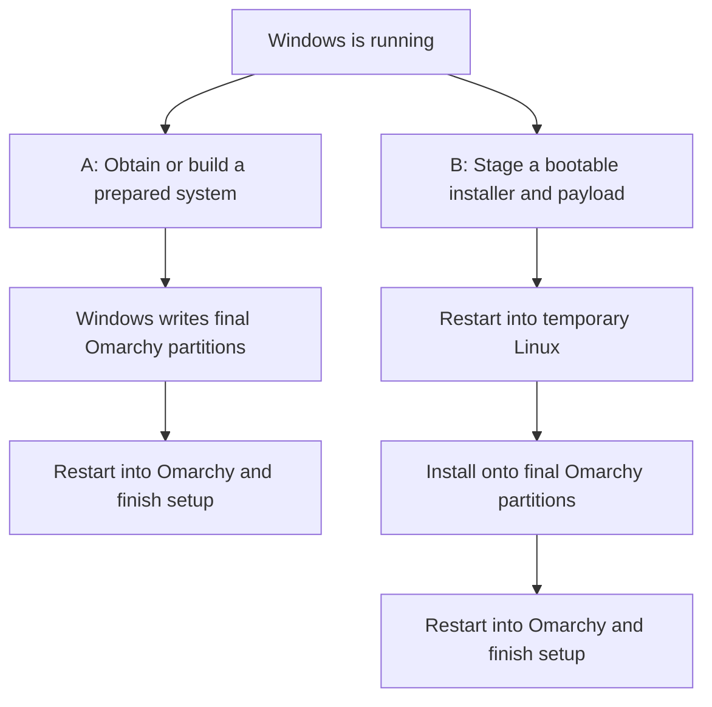

# Direct installation: consolidated brainstorming

Recorded 2026-09-12, from the September 5–12 discussion and the linked source
inspections. This is the consolidated entry point for the alternatives,
corrections, reasoning and open questions. It does not select a new architecture
or establish that a physical installation has succeeded.

The existing working preference remains local construction followed by native
Windows deployment. Staged installation and published system images remain
credible alternatives. Revisit this record before changing that preference.

## Scope and intended result

The comparison concerns Windows x86-64 on UEFI/GPT hardware, installing Omarchy
without a USB drive. The main case retains Windows on the same physical disk.
Free-space allocation, Windows shrinking and explicitly selected partition
replacement are separate storage policies, not different installation routes.

The final Omarchy system should live on its own native Linux boot/root partitions,
retain upstream first-boot owner setup and factory-reset behavior, and offer an
Omarchy/Windows boot menu where Windows is retained. Apple Silicon uses its own
Asahi-based route; these x86 boot and encryption conclusions do not automatically
apply to macOS or Intel Macs.

## Two routes, with independent image-source choices

**A — Write a prepared system from Windows.** Obtain or construct an installed
Omarchy system, then use the Windows helper to write its boot/root images into
the agreed physical partitions. Restart into Omarchy for hardware/capacity
finalization and owner setup. There is no temporary physical installer partition,
but the final boot/root partitions and temporary working files still exist.

**B — Stage an installer and install after reboot.** In Windows, prepare bootable
internal storage containing a live installer and accessible installation files.
Restart into that temporary Linux environment, install onto the agreed destination,
then boot the installed Omarchy system. Retire staging only after it is no longer
needed and the installed system can boot independently.



The image source is a separate choice:

| Variant | Work on the user's machine | Work we or upstream maintain |
| --- | --- | --- |
| A, build locally | Run Linux installation tools in a local environment, export the result and write it from Windows. | Builder integration, deployment and first-boot finalization. |
| A, download a prepared system | Verify, decompress and write the prepared images; complete per-machine setup. | Versioned system-image production, distribution, unique encryption and finalization. |
| B, run the installer | Boot live Linux and create the installed system on the actual hardware. | Internal boot/staging integration, protected destinations and recovery across reboots. |
| B, deploy a prepared filesystem | Boot live Linux, prepare the destination and populate it from a prepared payload. | Both payload publication and live deployment integration. |

An **installer ISO** contains a bootable environment and installation materials.
An **installed-system image** contains the system to deploy. Calling both a
“prebuilt ISO” concealed this distinction. A prepared filesystem payload can be
used by either route; its file format does not decide when installation occurs.

## Linux, WSL 2, QEMU, WHPX and Docker

Booting an installer already loads Linux: firmware starts the bootloader, which
loads the Linux kernel and a temporary live system, which runs the installer.
The permanent Linux installation need not exist yet; the temporary environment
already supplies Linux for the installer.

Building Omarchy while Windows continues running requires an environment for its
Linux installation tools. WSL 2 is one option, not a mandatory prerequisite of
all direct installation. Windows can copy a prepared partition image as bytes
without mounting or understanding its inner Btrfs filesystem. Constructing that
system involves package hooks, metadata, encryption and boot configuration in
addition to filesystem creation.

| Construction option | What it supplies | Retained limitation |
| --- | --- | --- |
| Current Docker + QEMU recipe | A packaged Linux tool environment containing a VM that runs the official installer. | Current recipe uses software emulation; high local resource cost and incomplete full-build proof. |
| Native Windows QEMU + WHPX | A VM with Windows hardware acceleration, without Docker or WSL. | Requires the Windows feature and firmware virtualization; needs actual construction benchmarks. |
| WSL 2 + QEMU/KVM | Linux tooling plus a nested VM. | KVM acceleration must be exercised, not inferred from the existence of `/dev/kvm`. |
| Build directly inside WSL 2 | Linux tooling without the inner VM. | Requires adapting the installation process; WSL's presence alone does not make the stock flow compatible. |
| Installer running after reboot | Linux on the actual hardware. | Adds the internal boot, staging and cross-reboot installation work of route B. |

Docker packages an environment; QEMU runs a VM; WHPX/KVM accelerate it. Removing
Docker and removing the VM are separate changes. Docker Desktop commonly already
uses WSL 2, so “replace Docker with WSL” does not by itself establish a speed gain.
Docker can also be used only on release-build machines, with no client dependency.

Native filesystem tools and Windows filesystem drivers were considered, but
filesystem creation alone does not replace Omarchy's package installation and
setup. The explored `mkfs.btrfs --rootdir`, Rust filesystem construction and
WinBtrfs possibilities are not a qualified Windows-native builder. Details are in
[the earlier learnings](installation-options-learnings-2026-09-08.md).

## Map of the shared concerns

| Concern | Route A | Route B |
| --- | --- | --- |
| Protect Windows and other retained partitions | The native writer must prove and bound its destination. | The live installer must revalidate the destination and protect retained/source partitions. |
| Omarchy's source-disk exclusion | Local construction targets a disposable virtual disk; the Windows writer handles the physical disk. | The stock wizard blocks the disk containing its media; a protected same-disk path is needed. |
| Read the installation files | Windows reads its normally unlocked volume; a VM can receive files through virtual media. | Linux needs readable installation storage; keeping it outside encrypted Windows avoids that dependency. |
| BitLocker recovery at the next Windows boot | Depends on boot configuration and protector policy, not just the Windows origin of the writes. | Same concern, with preparation/restoration coordinated across the installer reboot. |
| Secure Boot | The eventual Omarchy boot chain must be accepted by firmware. | Both the temporary installer and eventual installed system need acceptable boot chains. |
| Omarchy encryption | Fresh local construction can create unique LUKS; reusable images need a per-installation encryption design. | Live Linux can create fresh LUKS directly before populating the destination. |
| Temporary space | Source files, virtual disks and exports may be large; no temporary boot partition. | Staging/payload capacity is needed; source lifetime constrains reuse and removal. |
| Hardware and capacity | A system built elsewhere needs destination finalization and growth. | Installation sees the actual hardware; capacity/layout still need validation. |
| Owner setup and reset | Preserve upstream provisioning state, menu hooks and factory baseline through export/deployment. | Integrate deferred setup with a bounded destination rather than invoking the stock whole-disk choice. |
| Recovery and cleanup | Track partial allocation, writes, boot registration and BitLocker restoration. | Also persist and recover the Windows-to-live handoff and temporary boot/source state. |

## Installer policy is not a UEFI prohibition

The inspected Omarchy 4.0.2 configurator resolves its boot source to the parent
physical disk and excludes that disk from the destination picker. Its stated
purpose is preventing the installation media from being selected for a disk wipe.
The current source inspected during this discussion retains that check.

The free-space installation path separately refuses a selected disk containing
a BitLocker signature, including suspended BitLocker. The historical upstream
rationale is avoiding unexpected recovery-key prompts for users who lack their
key, not establishing that writing separate unused sectors is impossible.

Removing these checks would be a small source edit. A supported replacement must
restrict writes to the selected destination, protect Windows and source storage,
keep the live system and package source available, and handle interrupted work.
Hiding the source disk from detection is not that replacement.

The historical upstream restore proposal explicitly contemplated installation
from protected internal restore partitions on the same disk, with the live
environment copied to RAM before disk mutation. It is evidence of a proposed
design, not proof that the shipped consumer ISO supports our route.

Sources: [configurator](https://github.com/omacom/omarchy-iso/blob/quattro/configs/airootfs/root/configurator),
[historical protected-install rationale](https://github.com/omacom/omarchy-iso/blob/8b3dcc68b23dc00cf2d3e75cfe9e7afeff5501e4/plans/protected-partition-install.md),
and [our released-ISO findings](staged-iso-first-plan.md#first-feasibility-gates).

## BitLocker: file access, boot trust and installer policy

These are three distinct questions:

1. **Can Linux read the payload?** Libertix's chosen route requires plain NTFS
   access to installation files on Windows. Our proposed separate unencrypted
   staging area could avoid reading Windows at all. All required handoff/state
   files, not just the large ISO, must be accounted for.
2. **Will Windows unlock normally afterward?** Changes to its boot environment
   can trigger recovery in either route. Starting the operation inside Windows
   does not automatically prevent this.
3. **Will Omarchy's installer allow the layout?** Its stock BitLocker refusal
   remains even if the payload is elsewhere. Solving file access does not remove
   that separate policy check.

Full decryption removes Windows volume encryption. Suspension leaves the data
encrypted but temporarily permits access through a clear key; it is a maintenance
window, not the same protection state as active BitLocker. Restore protection
deliberately and verify the result. Do not silently leave Windows suspended while
the user remains in Linux. Ordinary Linux NTFS access is not established merely
by suspending Windows protection.

Our specification-supported conclusion applies to the defined compatible case:
native UEFI, Secure Boot already off and unchanged, an established direct Windows
firmware boot, a supported default TPM validation profile, unchanged Windows boot
files/BCD, and compatible firmware reset behavior. Under those conditions, the
menu design below supports same-session suspension/deployment/restoration without
an extra Windows boot solely for restoration. Hardware qualification is pending.

This does not extend automatically to custom profiles, existing third-party
Windows boot chains, pending boot/firmware updates, or changing Secure Boot.
The current source checks actual protector/profile and measured boot-route
evidence. Changing Secure Boot is a separate preparation flow followed by return
to Windows and fresh inspection. It is not included in a universal one-session
installation promise.

Route A makes Windows-side coordination convenient. Route B needs its own
cross-reboot restoration and failure policy; neither full decryption nor an
extra Windows boot has been established as universally necessary for every
possible adapted route B design.

In particular, **automatic restoration does not require Windows to write the
Omarchy filesystem**. An adapted route B can return to Windows after installation,
run its registered completion helper, verify that protection is active, and then
continue to Omarchy. That adds a Windows visit during setup. Restoring protection
before leaving Windows is another candidate only where the subsequent installation
preserves the measured Windows boot state. Neither sequence is qualified for our
staged installer. A scheduled task cannot restore protection while Windows is
not running; leaving it until an optional future Windows visit would leave an
unbounded suspension window.

Sources: [Microsoft recovery and suspension](https://learn.microsoft.com/en-us/windows/security/operating-system-security/data-protection/bitlocker/recovery-overview),
[the detailed specification analysis](evidence/bitlocker-direct-boot-research-2026-09-06.md),
and [implemented eligibility/preparation](evidence/windows-direct-readiness-2026-09-06.md).

## UEFI, Secure Boot and the permanent OS menu

UEFI selects and launches boot programs. Secure Boot validates the boot software
against firmware trust. Omarchy's destination checks are a separate installer
policy. Changing the latter does not solve Secure Boot or BitLocker transitions.

The current x86 boot design requires Secure Boot disabled. Adding an accepted
signed Omarchy boot chain would be separate work. A signed temporary installer
alone does not establish that the installed Omarchy system can boot with Secure
Boot enabled.

The OS selection menu is independent of whether route A or B installed the system:

```text
Power on -> Omarchy / Windows menu
             Omarchy -> start Omarchy
             Windows -> set original Windows entry as BootNext
                        -> automatic firmware restart
                        -> original Windows Boot Manager -> Windows
```

The user selects Windows once. The automatic restart skips the menu for that
boot; the next ordinary startup returns to the menu. The extra firmware restart
is the user-visible tradeoff. This preserves Windows' original boot route rather
than inserting menu execution into the same Windows startup sequence.

The menu uses Limine's `efi_boot_entry` protocol. It is configured in our source,
but configuration and specification reasoning are not hardware boot proof.
Route B would need to integrate and qualify this same eventual menu behavior.

Sources: [menu generator](../providers/image-builder-x86/boot_menu.py),
[Limine v12.6.0 implementation](https://github.com/Limine-Bootloader/Limine/blob/v12.6.0/common/protos/efi_boot_entry.c),
and [menu/BitLocker analysis](evidence/bitlocker-direct-boot-research-2026-09-06.md).

## Can we combine the benefits more effectively?

Follow-up recorded September 12: do not turn the costs of the current design into
universal limitations. Separate **one-time setup costs**, **costs on later boots**,
**hardware compatibility**, and **work borne by the project**. A smoother user
experience may require more integration and release maintenance. No candidate
below is an established replacement for the current architecture.

### Alternative menu: establish a new trusted Windows boot route once

The current menu preserves the existing Windows route by restarting. A different
candidate is a stable menu that directly launches Windows Boot Manager in the
same boot, with a controlled BitLocker transition during setup:

1. While Windows is running, prepare the transition and temporarily suspend
   protection when required; keep the volume encrypted.
2. Complete the boot changes, then start Windows **through the final intended
   menu and its direct Windows entry**, while protection is suspended.
3. Have the Windows completion helper resume protection and verify the result.
4. Qualify subsequent Windows starts through that same menu with protection
   active. If successful, selecting Windows no longer needs the extra firmware
   restart used by the current design.

Microsoft documents that resuming protection reseals to changed measurements, and
that `EnableKeyProtectors` refreshes TPM protectors against the current startup
state. Those are documented mechanisms; their successful application to this
Omarchy/Limine configuration is an **untested design inference**.
Sources: [BitLocker FAQ](https://learn.microsoft.com/en-us/windows/security/operating-system-security/data-protection/bitlocker/faq)
and [EnableKeyProtectors](https://learn.microsoft.com/en-us/windows/win32/secprov/enablekeyprotectors-win32-encryptablevolume).

The timing matters: resuming in the old Windows session, or returning directly to
the original firmware Windows entry, does not establish trust in a newly inserted
menu. This candidate trades a setup-time Windows boot for potentially removing
a restart on every later Windows selection. It can accompany either installation
route; the Windows filesystem does not have to contain the installation payload.

Remaining costs and limits:

- The menu and Windows boot sequence must produce measurements acceptable to
  the actual protector policy. One successful start while suspended proves
  nothing about the next protected start.
- Menu/firmware updates and alternate Windows boot paths can change the relevant
  measurements. Direct firmware fallback to Windows must be tested separately;
  it cannot automatically inherit the promise for the new menu route.
- Omarchy currently updates its Limine binaries. A separate, infrequently changed
  front menu could isolate Windows from those updates, but adds another maintained
  boot component. Its own updates still need a coordinated BitLocker lifecycle,
  including updates initiated while the user is in Linux.
- Preserve the user's protection requirements; weakening the TPM validation
  profile or leaving protection suspended would not meet the intended result.
- The existing [menu generator](../providers/image-builder-x86/boot_menu.py)
  enforces restart-based Windows entries, and
  [measured-boot inspection](../providers/direct-x86/NativeBootEvidence.cs)
  accepts a direct Windows firmware boot. Supporting the candidate requires a
  distinct eligibility/transition path and validation, not just a menu edit.

### Compare combinations, not just routes A and B

| Combination | Potential user benefit | Remaining price or uncertainty |
| --- | --- | --- |
| Current menu: restart into the original Windows entry | Preserves the measured Windows startup route in the defined compatible case; enables same-session restoration for route A. | Extra firmware restart on each Windows selection; hardware qualification remains pending. |
| Stable menu plus setup-time BitLocker resealing | Automatic OS menu and potentially direct Windows startup thereafter, with automatic protection restoration. | Windows setup visit, a changed trusted boot route, coordinated menu updates and new qualification work. |
| Firmware's own boot chooser | Can select each OS's original firmware entry directly without our menu performing an additional restart. | Firmware-specific interface, often a hotkey; cannot promise a consistent automatic chooser on every PC. Measured boot still needs qualification. |
| Prepared system payload plus a small live Linux deployment stage | No client-side Docker/WSL/VM build; Linux can create fresh encryption and populate the native destination directly. Separate staging can keep payload access independent of Windows decryption. | Published-image maintenance, temporary boot/storage integration, installation reboot, safe same-disk writes and first-boot integration. BitLocker completion remains a separate choice. |
| Keep Secure Boot enabled with a complete accepted boot chain | Could avoid the firmware setting change and its preparation visit on compatible PCs. | Requires support for the installed Omarchy boot chain and its updates, not just a signed temporary installer. This is separate work and does not itself prove BitLocker compatibility. |

The prepared-payload/live-deployment combination was already present in the image
source matrix. It is worth evaluating as a complete user journey, but is not a
newly discovered third installation route. A conventional installer in the live
stage also avoids a client-side VM and lets us build locally, at the cost of doing
package installation there. Choosing a published payload trades that construction
work for image-production and distribution responsibilities.

Secure Boot is not a shortcut around qualification. Microsoft documents recurring
BitLocker recovery for a particular PXE fallback sequence involving different
signed boot authorities. This is not evidence that all chainloading fails; it
does demonstrate why a signed menu alone is insufficient proof.
Source: [Microsoft Secure Boot troubleshooting](https://support.microsoft.com/en-us/servicing/os/secure-boot/2026/03/secure-boot-troubleshooting-guide).

### Next discriminating experiment

Evaluate the stable-menu transition independently of installing Omarchy: in a
disposable Windows/UEFI/TPM test system, establish the supported baseline, add the
candidate menu, perform the controlled suspended boot through it, resume and
verify protection, then test protected Windows boots. Cover Linux selection
followed by a later Windows boot, cold starts/restarts, direct firmware fallback,
menu updates and interruption of setup. Virtual tests can establish feasibility;
representative physical firmware is still needed for a support claim.

For either installation route, a completion flow must return to Windows when
needed and verify restoration before declaring success. Do not count an installed
Linux system plus an indefinitely pending Windows cleanup as completion.

This experiment would answer whether the recurring restart is avoidable on our
supported configurations before we reorganize image construction around it. It
has not been run, and this design discussion does not authorize host boot changes.

## Omarchy encryption, compression and first-boot setup

Windows BitLocker and Omarchy's LUKS encryption protect different partitions.
Keeping Windows encrypted does not prevent creating a separately encrypted
Omarchy destination. Image compression concerns the distributed/staged Omarchy
payload, not whether the existing Windows volume has BitLocker enabled.

Reusable plaintext filesystem images compress much better than encrypted data.
However, a reusable encrypted image also clones its underlying volume key.
Changing a password/keyslot does not create a fresh volume key. Each installation
needs a unique encryption design; a shared template password change is insufficient.

Options considered:

- Construct a fresh encrypted system for each operation, as the current local
  builder is designed to do.
- Distribute a compressed plaintext payload, create fresh LUKS on the destination
  in a Linux environment, then populate the filesystem through that mapping.
- Write a plaintext system first, then encrypt it from a separate Linux setup
  environment. This adds conversion, boot changes, interruption recovery and
  completion verification. It is not existing Omarchy first-boot functionality.

The inspected owner-setup flow replaces credentials on existing LUKS encryption.
It does not encrypt plaintext installations or rotate the underlying volume key.
Moving encryption to “first boot” is additional work, not just postponing the
existing password question.

Preserve upstream owner questions, setup/retry behavior, machine finalization and
factory reset. In the inspected release, provisioning state is in the installed
root and the factory baseline is a Btrfs subvolume; these are not disposable ISO
staging. The interactive “prepare for another owner” path selects whole-disk
installation and cannot be forwarded unchanged into an alongside installation.
Our local builder uses the installation engine's deferred configuration on a
disposable virtual disk instead.

For reusable images, retain Linux metadata, regenerate machine identity where
needed, finalize hardware/boot configuration, grow the destination and preserve
the factory baseline. A raw Btrfs payload fixes the filesystem type; offering ext4
would require another image or a file-based deployment approach.

Details: [released encryption contract](../providers/image-builder-x86/product-source-contract.md),
[owner setup requirements](direct-install-priority-2026-09-06.md#preserve-the-upstream-setup-workflow),
and [encryption alternatives](installation-options-learnings-2026-09-08.md#reusable-images-and-encryption).

## What Libertix demonstrates, and what it does not

The inspected [Libertix](https://github.com/ekimiateam/libertix) implementation
separates release construction from client installation. Developers use Docker
to build small Debian-based BIOS/UEFI live installer ISOs. Users download those
artifacts; client installation does not require Docker, WSL or a VM.

Windows stages the live environment separately and keeps the selected Mint/Zorin
ISO as a file on its Windows partition. After reboot, the live installer extracts
the distribution's compressed filesystem into an ext4 destination and configures
the system. It reuses the temporary installer partition after releasing it. The
finished Linux root is not a virtual-disk file inside NTFS.

Its chosen design requires full Windows decryption. No automatic re-encryption
step was found in the inspected successful-installation flow; its recovery code
explicitly directs the user to re-enable encryption when it cannot restore it.

Useful references include its persistent installation plan, repeated disk
identity checks, verified BootNext/fallback handling, source-partition lifetime,
rollback and actual installed-system boot evidence. These are source findings,
not tests we performed on Libertix or proof of Omarchy compatibility.

Sources: [build script](https://github.com/ekimiateam/libertix/blob/main/iso-tools/build-iso.sh),
[live installation](https://github.com/ekimiateam/libertix/blob/main/assets/live/libertix-install-main.sh),
[architecture](https://github.com/ekimiateam/libertix/blob/main/docs/ARCHITECTURE.md),
[boot handling](https://github.com/ekimiateam/libertix/blob/main/docs/UEFI_BOOTNEXT_BOOTORDER.md),
and [BitLocker recovery message](https://github.com/ekimiateam/libertix/blob/main/Pages/ApplyChanges.Cancellation.cs).

The exact extraction shortcut is not transferable to the official Omarchy ISO:
its live filesystem supplies the installer, which installs Arch/Omarchy using
bundled packages. Extracting that live filesystem alone is not a completed
Omarchy installation. We would run/adapt the official engine or supply a prepared
Omarchy payload. See the [upstream ISO description](https://github.com/omacom/omarchy-iso).

LinuxOneClick / Ventoy vdiskchain / vtoyboot were another reference discussed.
Booting a prepared virtual-disk file stored on NTFS can run Linux on real hardware,
but it leaves that file and its containing partition as dependencies. The user
wants native Linux partitions; this was not selected as the intended end state.

## Proposed upstream image request

We drafted a request for official, compressed, unencrypted **preinstalled system
images**, with fresh per-installation encryption during deployment/setup and
upstream first-boot owner questions preserved. The format need not be ISO.

The motivation is reducing repeated client-side installation work and avoiding
a separately maintained downstream image for every Omarchy release. Ask for the
desired deployment/setup behavior without assuming in-place first-boot encryption
is the only implementation. No upstream commitment or delivered image is
established by this discussion. Omarchy has a
[Suggestions category](https://github.com/omacom/omarchy/discussions/categories/suggestions).

## Performance, staging and maintenance costs

- Hardware acceleration is a candidate improvement to local construction; it is
  not a measured ranking of WHPX against WSL 2/KVM. One previous software-emulated
  attempt timed out after 30 minutes; this is a failure, not a typical install time.
- The recorded builder baseline of 10 GiB free RAM, 85 GiB temporary storage after
  source staging, and roughly 40 GiB destination space belongs to that recipe.
  Do not apply these requirements to WSL generally, prepared-image deployment or
  a staged native installer. Each needs measurement.
- Count the full route: downloads, construction, export, decryption/decompression,
  writes, readback, boot and first-boot finalization. Removing one component does
  not remove the remaining disk I/O.
- A published image moves work from users to a maintained release pipeline. It
  needs versioning, source verification, signing, compatibility checks and refreshes.
- Staging a bootable environment takes more than copying an ISO file. Boot/source
  discovery and readable filesystems must work; a FAT32 volume cannot hold an
  arbitrarily large ISO as one file. Removing staging does not automatically grow
  Omarchy into the reclaimed space.
- Reusing the staging partition is conditional on releasing every dependency on
  it. Libertix's behavior cannot simply be assumed for Omarchy's live system and
  package mirror. A full Windows replacement also needs a source/recovery plan
  that survives removal of the original Windows volume.

Evidence: [build attempts](evidence/image-builder/README.md),
[resource/runtime learnings](installation-options-learnings-2026-09-08.md),
and [staging investigation](staged-iso-first-plan.md).

## Corrections that must survive future discussion

| Earlier conflation | Retained correction |
| --- | --- |
| UEFI blocks same-disk installation. | Omarchy's picker excludes its source disk; UEFI is not that policy. |
| Writing from Windows guarantees no BitLocker recovery prompt. | Boot state and protector configuration determine compatibility; the conclusion is conditional and needs hardware qualification. |
| An unencrypted staging partition solves BitLocker. | It can solve payload access; Windows boot trust and Omarchy's stock refusal remain separate. |
| Any new OS menu necessarily changes Windows' own boot chain. | A menu can schedule the original Windows entry and restart; our design uses this with an extra automatic restart. |
| Every such installation must reboot Windows once before restoring protection. | That is not inherent in the defined already-compatible case; changed Secure Boot/custom profiles need separate handling. |
| Avoiding BitLocker recovery inherently requires a restart every time Windows is selected. | That is the current menu's tradeoff. A stable chainloading menu with a controlled setup-time reseal, or a firmware chooser, are separate candidates requiring qualification. |
| Automatic BitLocker restoration requires installing the Omarchy filesystem from Windows. | A staged installer can return to Windows for automatic completion; that adds a setup visit, not a requirement for Windows-side filesystem deployment. |
| Every drawback applies to the user on every boot. | Distinguish setup-only work, recurring startup costs, hardware limitations and project maintenance; combinations can shift costs between them. |
| WSL 2 is required for all direct installation. | It is one possible environment for local construction while Windows runs. |
| Libertix makes users build Linux in Docker. | Its developers build the small live installer with Docker; installation happens on hardware after reboot. |
| A booted installer runs before Linux loads. | The ISO first loads a temporary Linux system that runs the installer. |
| A prebuilt image means no client-side finalization or encryption work. | Publication removes package construction, not machine identity, boot, growth, setup and encryption requirements. |
| Changing the image password makes encryption unique. | LUKS keyslot changes do not rotate a cloned volume key. |
| “Prepare for another owner” is already plaintext-to-encrypted first boot. | The inspected flow configures an already encrypted installation. |
| A few removed checks establish a reliable staged installer. | The replacement needs protected destinations, source continuity, boot and recovery validation. |

## Current state and evidence still needed

The current source implements route A with local Docker/QEMU construction, native
Windows deployment, conditional BitLocker handling and the restart-based Windows
menu. Pure tests, file-backed transfer checks and UI checks exist. They do not
establish a completed encrypted build, successful physical deployment or hardware
BitLocker/owner-setup/reset behavior. Consult the
[Windows path review](evidence/windows-direct-path-review-2026-09-07.md) for the
scope of those checks rather than treating “implemented” as “qualified.”

Published prepared Omarchy images and an adapted staged Omarchy installer remain
alternatives, not completed replacements. Libertix demonstrates a different
project's implementation, not our end-to-end proof.

Before ranking the alternatives, establish:

1. A completed, independently booted local image and measured construction/export
   costs with working acceleration.
2. For a reusable image, fresh per-installation encryption, hardware/capacity
   finalization, owner setup/retry and a correct factory-reset baseline.
3. For staging, boot and installation from the **same disposable disk**, preserving
   source and retained partitions through normal and interrupted operations.
4. Windows return through the menu with protection active on supported firmware,
   including the separate Secure Boot transition where applicable.
5. Whole-route time, RAM, disk-space and maintenance costs for each candidate.

These are open evidence requirements, not permission to install or alter this
workstation as part of recording the brainstorm. The present update changes
documentation only.
