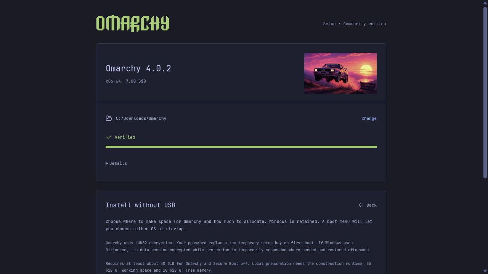
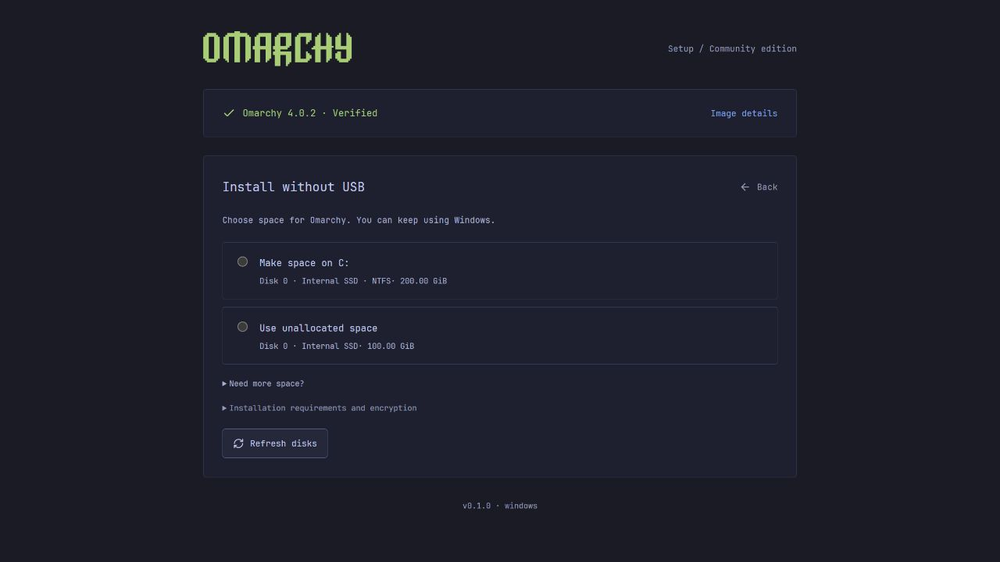
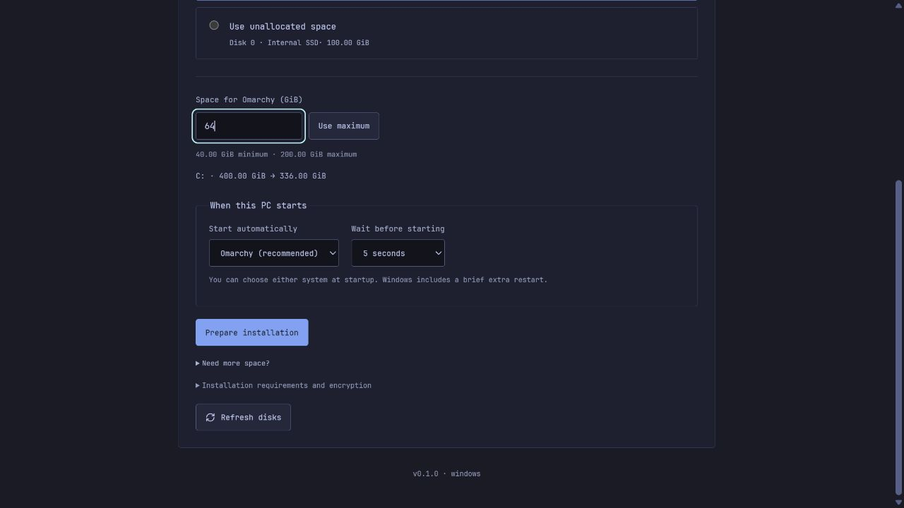
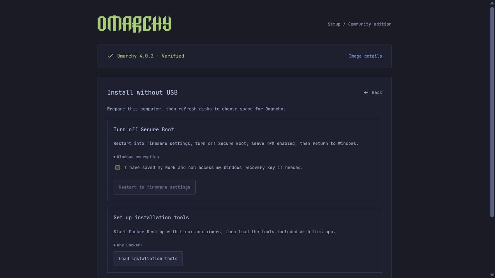
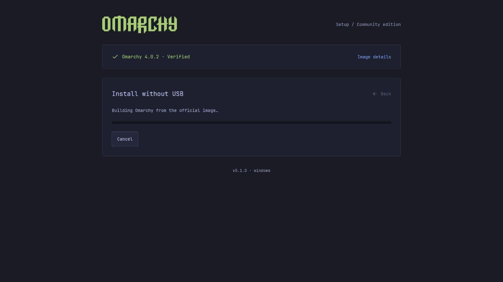
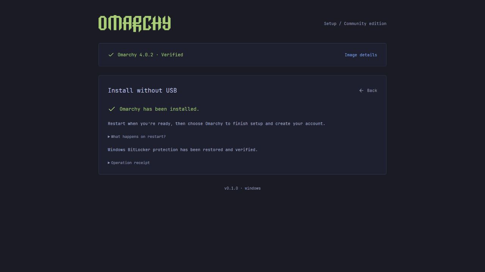
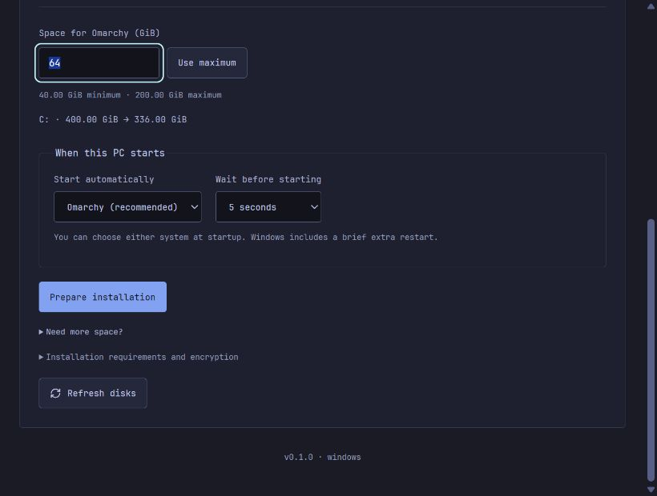

# Windows no-USB path review

Reviewed September 7–8, 2026. Model: `gpt-6-astra`. Base commit: `6a77c73`.

The review reduced repeated explanation and fixed three concrete Windows
failure paths. It also strengthened the helper's plan and completion checks.
This is a code review with regression and UI verification, not physical
installation qualification.

## Findings and changes

| Priority | Finding | Change and evidence |
| --- | --- | --- |
| P1 | Partition I/O used a managed stream buffer without guaranteeing the alignment required for noncached volume access. A fragmented source read could also produce a partial transfer. | Aggregate source reads, use a 64 KiB aligned unmanaged buffer, issue explicit unbuffered/write-through I/O, flush, and verify the complete destination by uncached readback. Reject short I/O and hash mismatches. Seven file-backed Windows cases pass; sentinel bytes outside the image stay intact. |
| P1 | A zero-partition GPT disk could fail `Get-Partition -DiskNumber`. The same query after deleting a disk's last partition could stop deployment after deletion. | Query the disk's CIM partition collection and compare its count with the independently reported partition count. Empty is accepted only for a known zero count. Errors and incomplete inventories block installation. The old blank-disk behavior fails the new regression; the corrected implementation passes. |
| P2 | Protected-path discovery depended on inherited `ProgramData`, which the privileged helper clears. Replacement choices could therefore be unavailable even on otherwise supported storage. | Resolve the system data directory through `Environment.GetFolderPath`. A regression runs the actual discovery function with the environment variable absent. |
| P1 | Helper completion relied on the provider result without a comprehensive binding check against the approved direct-install plan. | Validate operation, disk identity, allocation, partition extents, digests, startup settings and policy before confirmation; validate the deployment receipt, readback, registered boot entry and restoration of every suspended volume before success. Existing exact shrink/deletion checks remain. Mutation tests reject inconsistent or incomplete results. |
| P2 | The verified download occupied most of the initial screen, while storage and startup controls repeated several explanatory paragraphs. | Collapse the verified image into a single row. Keep details available on demand. Shorten disk labels, allocation text and startup explanation. Preserve size limits, deletion warnings and final approval. |
| P2 | Preparation, active progress and completion repeated unrelated setup instructions. Changes to image state could also hide active progress or success. | Show preparation actions first; reveal storage once preparation is ready. Keep progress and completion visible independently of later download state. Lock image-changing controls during setup. Completion gives the next action and retains details and receipts. |
| P2 | Long Windows operations could show a generic label or stale progress from a preceding partition. | Name firmware/encryption checks, disk inspection, image preparation, writing, flushing, readback, boot registration and BitLocker restoration. Reset progress when starting each encrypted export. Inspection stages do not advertise unavailable cancellation. |

Windows API references used for the I/O review:
[file buffering and alignment](https://learn.microsoft.com/en-us/windows/win32/fileio/file-buffering),
[volume handle behavior](https://learn.microsoft.com/en-us/windows/win32/api/fileapi/nf-fileapi-createfilea),
[full partition access](https://learn.microsoft.com/en-us/windows/win32/api/winioctl/ni-winioctl-fsctl_allow_extended_dasd_io),
and [partition CIM schema](https://learn.microsoft.com/en-us/windows-hardware/drivers/storage/msft-partition).
Full-partition access is enabled only on the newly created, reidentified and
locked partition handle. The writer still bounds every transfer to its image.

## Screen evidence

Screenshots were captured before editing and compared with the updated screens
in the same review run. They render production Svelte components with synthetic
Windows state through `apps/desktop/test-fixtures/windows-direct.html`. They do
not show the user's disks or prove that an installation completed.

1. **Choose space.** The verified image and disk choices now fit within the
   default review viewport. Details remain collapsed initially.

   
   

2. **Choose size and startup settings.** The before/after Windows size remains
   visible. The final fixture uses the native 64 GiB recommendation; the initial
   fixture used 80 GiB. Invalid input disables preparation. Tab navigation reaches
   the size field with a visible focus indicator.

   

3. **Prepare the computer if necessary.** Firmware restart still requires the
   saved-work/recovery-key acknowledgement. Encryption and compatibility details
   are available through disclosures; duplicated disabled storage choices are gone.

   

4. **Follow progress, then restart when ready.** Running stages show their current
   work. The completion screen explains first boot and retains the operation receipt.

   
   

The 820 × 620 minimum desktop viewport also allows selection and scrolling to
all allocation/startup controls without horizontal clipping. Retry guidance was
checked in the failed-state fixture. These checks are not a full accessibility audit.

## Validation and limits

- UI regression suite: 22 tests passed. Static Svelte checking: zero errors,
  four existing unused-selector warnings in unrelated views.
- Rust library: 28 passed, three existing opt-in tests ignored. New tests reject
  changed plans, missing receipt fields and inconsistent BitLocker restoration.
- Windows planner regressions, seven partition-transfer file cases, protector
  policy cases and 541 synthetic measured-boot parser checks passed.
- Python builder syntax check and production frontend build passed.
- The Windows portable build performs its own staged-media file-write check and
  extraction/hash verification; its output record is the source for package results.

No host partition was resized, deleted or written for these checks. Firmware,
BitLocker lifecycle, encrypted system construction, owner setup and first boot
still require an end-to-end test on an appropriate target machine. The native
final confirmation was reviewed in code and through plan-binding tests; it was
not exercised through a real installation/UAC flow. The new full-partition I/O
path also needs physical volume-driver qualification. The file-backed tests
cover the transfer loop, not raw-volume locking or dismounting.
